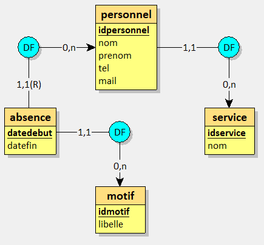
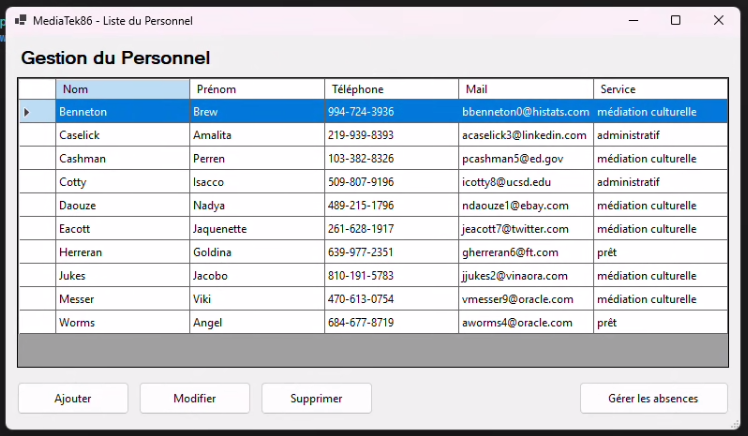
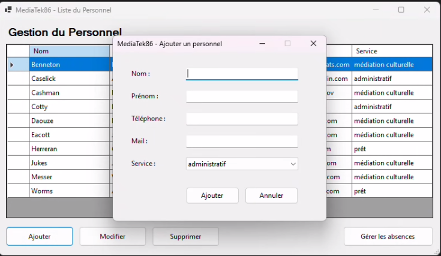
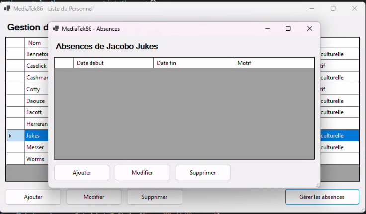
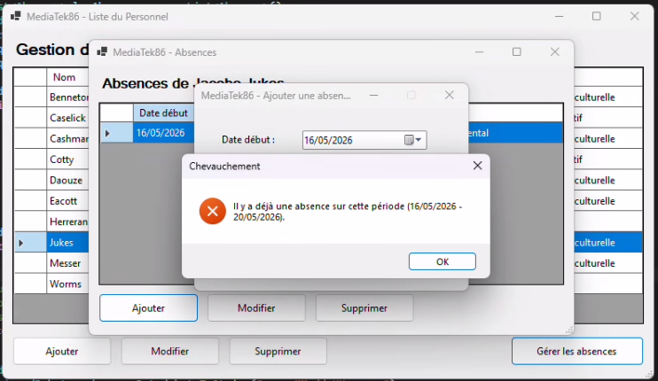
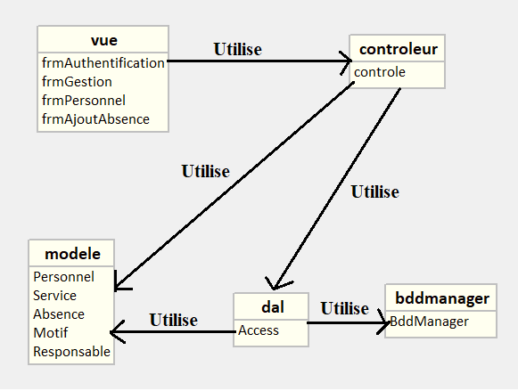

# MediaTek86 - Gestion du Personnel

## 1. Contexte et but de l'application

L'application MediaTek86 a été développée dans le cadre de l'atelier 2 (BTS SIO SLAM) pour le réseau des médiathèques de la Vienne. Elle permet au responsable du service administratif de gérer le personnel des médiathèques, leurs affectations aux services (Administratif, Médiation culturelle, Prêt) et leurs absences.

L'application est sécurisée par une authentification (login + mot de passe hashé en SHA-256). Elle empêche la saisie d'absences qui se chevauchent pour un même employé.

### MCD

## 2. Interfaces

L'application comporte 5 fenêtres :

- Authentification : fenêtre de connexion avec login et mot de passe
- Gestion du personnel : liste du personnel avec boutons Ajouter, Modifier, Supprimer et Gérer les absences
- Ajout/modification personnel : formulaire avec les champs nom, prénom, téléphone, mail et liste déroulante pour le service
- Gestion des absences : liste des absences d'un personnel avec boutons Ajouter, Modifier, Supprimer
- Ajout/modification absence : formulaire avec date début, date fin et motif dans une liste déroulante

Voici un aperçu des différentes interfaces de l'application :

### Fenêtre de connexion

### Gestion du personnel (Fenêtre principale)

*Ajout d'un membre du personnel :*

### Gestion des absences

*Contrôle de chevauchement lors de l'ajout d'une absence :*

## 3. Diagramme de paquetages

Le projet est organisé en MVC comme dans l'application Habilitations vue en cours :

- controleur : contient Controle.cs qui fait le lien entre les formulaires et les données
- bddmanager : contient BddManager.cs (connexion MySQL en singleton)
- dal : contient Access.cs (requêtes SQL)
- modele : contient les classes métier Personnel, Service, Absence, Motif, Responsable
- vue : contient les formulaires FrmAuthentification, FrmGestion, FrmPersonnel, FrmAbsence, FrmAjoutAbsence
- Program.cs : point d'entrée de l'application

Les formulaires passent toujours par le contrôleur pour accéder aux données.

## 4. Étapes de construction et commits

1. Création de la BDD et du script SQL
2. Initialisation du projet C# WinForms et mise en place de la structure MVC
3. Création des classes métier (Personnel, Service, Absence, Motif, Responsable)
4. Mise en place de BddManager (singleton) et de la classe Access pour les requêtes SQL
5. Interface et fonctionnalité de connexion avec contrôle SHA-256
6. Gestion du personnel (ajout, modification, suppression)
7. Gestion des absences avec contrôle de chevauchement
8. Finalisation, tests et nettoyage du code

## 5. Installation

### Prérequis

- WampServer (ou XAMPP) avec MySQL
- Visual Studio 2022
- .NET 9.0

### Base de données

1. Démarrer WampServer (icône verte)
2. Ouvrir phpMyAdmin
3. Aller dans l'onglet SQL
4. Copier-coller le contenu du fichier create_db_mediatek86.sql
5. Cliquer sur Exécuter

Le script crée la base mediatek86, les tables, l'utilisateur MySQL et les données de test.

> La connexion dans le code utilise root sans mot de passe (config par défaut de WampServer). Si votre config est différente, modifier la chaîne de connexion dans dal/Access.cs.

### Exécuter l'application à partir du code source

1. Démarrer WampServer
2. Ouvrir Mediasoft.slnx dans Visual Studio 2022
3. Compiler (Ctrl+Maj+B)
4. Lancer (F5)

### Installer l'application

1. Télécharger le logiciel à partir de https://github.com/Lou310/MediaTek86/releases
2. Extraire l'archive "Installer_MediaTek86.zip" et exécuter "setup.exe"
3. Exécuter setup.exe et installer le logiciel
4. Démarrer WampServer
5. Ouvrir phpMyAdmin
6. Aller dans l'onglet SQL
7. Copier-coller le contenu du fichier create_db_mediatek86.sql
8. Cliquer sur Exécuter
9. Démarrer MediaTek86

## Exécuter le logiciel

1. Démarrer WampServer
2. Lancer MediaSoft86

### Identifiants de connexion

- Login : admin
- Mot de passe : admin123

## 6. Fonctionnalités

- Connexion sécurisée (mot de passe hashé en SHA-256), message d'erreur si login ou mot de passe incorrect
- Ajouter, modifier, supprimer un personnel
- Quand on supprime un personnel, ses absences sont aussi supprimées pour pas avoir de données orphelines
- Afficher les absences d'un personnel (tri chronologique décroissant)
- Ajouter, modifier, supprimer une absence
- Contrôle de la date de fin : impossible d'enregistrer une absence si la date de fin est antérieure à la date de début
- Contrôle du chevauchement des absences : impossible d'enregistrer une absence qui chevauche une absence déja existante pour le même personnel
- Confirmation avant suppression et modification
